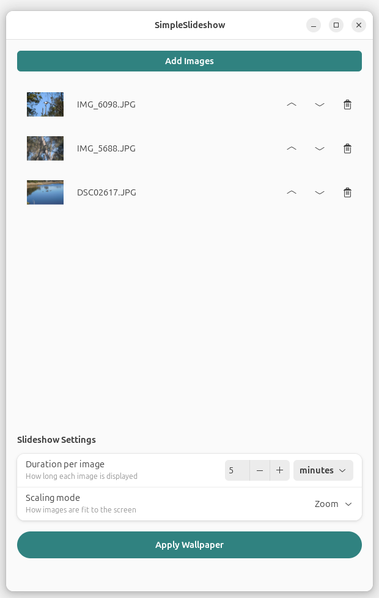

# SimpleSlideshow

A simple GNOME wallpaper slideshow configurator for Ubuntu.



## Features

- Select multiple images for your slideshow
- Configure duration per image
- Configure transition (crossfade) duration
- One-click apply to set as your desktop background

## Installation

### Ubuntu / Debian

```bash
# Install dependencies
sudo apt install python3-gi gir1.2-gtk-4.0 gir1.2-adw-1

# Run the app
./simpleslideshow.py
```

### Other distributions

Install the equivalent packages for your distribution:
- Python 3 with PyGObject
- GTK 4
- libadwaita

## Usage

1. Click "Add Images" to select images for your slideshow
2. Use the up/down arrows to reorder images
3. Set how long each image should be displayed
4. Set the transition duration (0 for instant switch)
5. Click "Apply Wallpaper"

Your slideshow is now active! The wallpaper will cycle through your selected images.

## How it works

SimpleSlideshow generates GNOME-compatible XML configuration files:

- `~/.local/share/backgrounds/simpleslideshow/slideshow.xml` - Slideshow definition
- `~/.local/share/gnome-background-properties/simpleslideshow.xml` - Registers the slideshow with GNOME

These follow the standard GNOME slideshow wallpaper format documented at:
https://help.ubuntu.com/community/SlideshowWallpapers

## Requirements

- Ubuntu 22.04+ or other GNOME-based distribution
- GNOME desktop environment
- GTK 4 and libadwaita

## License

MIT
